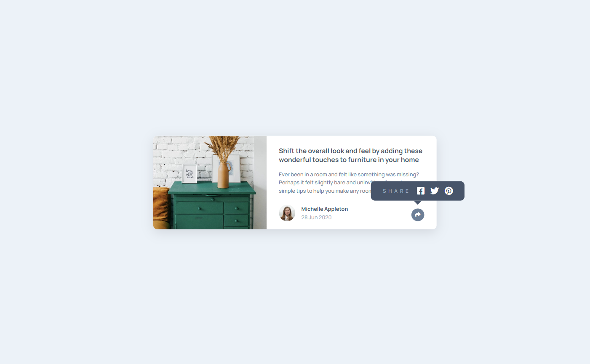

# Frontend Mentor - Article preview component solution

This is a solution to the [Article preview component challenge on Frontend Mentor](https://www.frontendmentor.io/challenges/article-preview-component-dYBN_pYFT). Frontend Mentor challenges help you improve your coding skills by building realistic projects. 

## Table of contents

- [Overview](#overview)
  - [The challenge](#the-challenge)
  - [Screenshot](#screenshot)
  - [Links](#links)
- [My process](#my-process)
  - [Built with](#built-with)
  - [What I learned](#what-i-learned)
  - [Continued development](#continued-development)
  - [Useful resources](#useful-resources)
- [Author](#author)
- [Acknowledgments](#acknowledgments)

## Overview

### The challenge

Users should be able to:

- View the optimal layout for the component depending on their device's screen size
- See the social media share links when they click the share icon

### Screenshot



### Links

- Solution URL: [Frontend Mentor](https://your-solution-url.com)
- Live Site URL: [Live Site](https://69kwan69.github.io/article-preview-component/)

## My process

### Built with

- Semantic HTML5 markup
- CSS custom properties
- Flexbox
- CSS Grid
- Mobile-first workflow

### What I learned

By far, this is the most confusing project I've ever encountered. The reason was because of my lack of understanding what I've been doing for the whole time:
  - Putting an image inside a div (HTML).
  - Using ```<i>``` tag inside a div (HTML).
  - Using animation instead of transition (CSS).
  - DOM target and Propagation (JS).
These things have caused me so many troubles which led to slowing my project process. Instead of wrapping the image inside a div, ```object-fit``` makes it much easier to control the image itself. Using Fontawesome with ```<i>``` tag seems reasonable enough but it also increases the complexity in HTML markups and the DOM control. The same applies to animating, because for the most of the time I want a smooth movement, therefore transition itself pulls it off just fine.
Of course, all of the things mentioned above isn't wrongdoing, but in my case, it's such a pain to deal with, especially when developing such a small project.

### Continued development

Try to avoid adding complexity to the code by:
  - Avoid putting image inside a div.
  - Applying Fontawesome with pseudo element.
  - For smooth 'transition', use transition.
  - Avoid stopping propagation.

### Useful resources

- [Setting up Font Awesome icons as pseudo-elements](https://www.youtube.com/watch?v=lMBa7gLWyO4) 
- [Check if clicked element is descendant of parent, otherwise remove parent element](https://stackoverflow.com/questions/34621987/check-if-clicked-element-is-descendant-of-parent-otherwise-remove-parent-elemen)

## Author

- Frontend Mentor - [@69kwan69](https://www.frontendmentor.io/profile/69kwan69)
